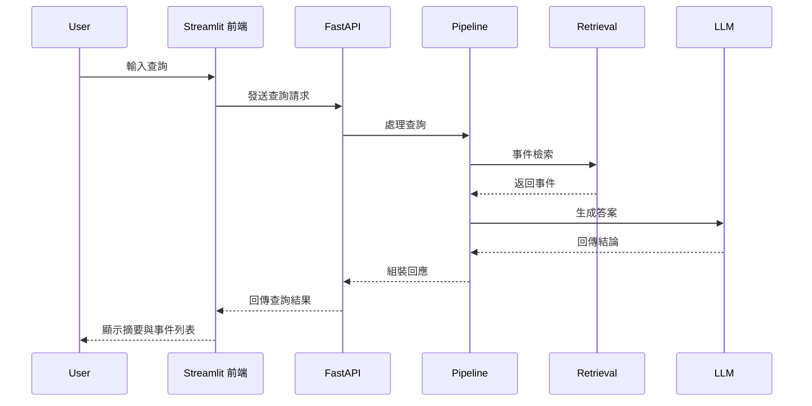

# Visual_Question_Answering(VQA) - 安防視頻問答系統

## 1. 專案使用場景
- 企業級安防監控、智慧建築、公共空間事件追蹤
- 需以自然語言查詢監控影片、快速獲得異常事件摘要
- 支援安防人員、管理者、運維團隊即時決策

## 2. 專案需求與目標
- 讓非技術用戶能以中文/自然語言查詢監控內容
- 自動檢索、彙整異常事件，並以 AI 生成摘要
- 提供可視化查詢介面，降低學習門檻
- 支援事件追蹤、證據查詢、異常告警等需求

## 3. 專案實現功能（MVP 版本）
- 支援自然語言查詢監控影片
- VLM-RAG 智慧檢索與事件摘要
- LLM 生成精簡結論（僅 answer，不含多餘說明）
- 事件列表顯示事件編號、描述、分數、圖片
- Streamlit 前端一頁式查詢介面
- E2E 測試、AI 品質效能評估、UX 報告

## 4. 專案使用流程

> ⚠️ **注意：首次啟動前請先完成 API Key 設定與資料庫初始化，否則系統無法正常運作。**

### 初始化步驟
1. 執行 `python scripts/init_project_dirs.py`，自動建立影片與相關目錄結構。
2. 申請 OpenAI/Anthropic API Key，並依 docs/llm/model_selection.md 設定 `.env` 或 `configs/default.yaml`（本專案 LLM/embedding 皆預設為雲端 API 調用）。
3. 將影片檔案放入 `Anomaly-Videos-Part-1` 目錄。
4. 初始化向量資料庫（chroma_db），可執行 `scripts/test_index_pipeline.py` 或依 docs/architecture/data_flow.md 步驟建立索引。
5. 檢查 `configs/` 與 `.env.example`，複製為 `.env` 並依需求調整參數（可參考 `configs/default.yaml`）。

### 啟動流程
1. 啟動後端（FastAPI）：`uvicorn src.api.vqa_api:app --reload`
2. 啟動前端（Streamlit）：`streamlit run frontend/app.py`
3. 使用者輸入查詢問題（如「昨天下午大廳有異常活動嗎？」）
4. 系統自動檢索事件，AI 回答僅顯示結論，事件列表顯示細節
5. 支援事件編號查詢、圖片點擊、回饋提交

## 5. 後續規劃
- UX/AI 品質評分與用戶回饋持續補充
- LLM 回答格式進一步優化
- 多語言查詢與國際化支援
- 查詢日誌、異常自動告警、權限管理
- 長期：推理效能優化、模型升級、API 擴展

---
### 專案框架

本專案採用「多模組分層」設計，核心流程如下：

1. 前端（frontend/）：Streamlit UI，負責查詢輸入、結果展示、用戶回饋。
2. API 層（src/api/）：FastAPI 提供 VQA 查詢、回饋等 RESTful API。
3. Pipeline 層（src/pipeline/）：負責查詢流程協調、錯誤處理、格式轉換。
4. 檢索層（src/retrieval/）：VLM-RAG 事件檢索、向量查詢、資料庫管理。
5. LLM 層（src/llm/）：提示詞設計、LLM API 封裝、答案生成。
6. 工具層（src/utils/）：日誌、驗證、通用工具。
7. 測試（tests/）：單元、整合、E2E 測試與評估報告。

### 模組功能簡介

- **frontend/**：Streamlit 前端，支援查詢、事件列表、AI 摘要、用戶回饋。
- **src/api/**：VQA API 與回饋 API，負責前後端資料交換。
- **src/pipeline/**：查詢協調、錯誤處理、格式化，串接檢索與 LLM。
- **src/retrieval/**：事件向量檢索、資料庫查詢、檢索服務。
- **src/llm/**：LLM API 封裝、提示詞管理、答案生成。
- **src/utils/**：日誌、驗證、共用工具。
- **tests/**：單元、整合、E2E 測試與品質報告。

### 模組流程圖與循序圖

#### 系統整體流程圖

```
[使用者查詢] → [前端 Streamlit] → [API (FastAPI)] → [Pipeline] → [Retrieval 檢索] ↔ [Pipeline] → [LLM 生成答案] ↔ [Pipeline] → [API] → [前端] → [使用者]
```

#### 查詢處理循序圖


### 技術棧

- Python 3.10+
- FastAPI, Streamlit
- VLM-RAG, LLM (OpenAI/Claude)
- Docker, Docker Compose

### 專案結構

```
Visual_Question_Answering(VQA)/
├── configs/
├── docker/
├── docs/
│   ├── api/
│   ├── architecture/
│   ├── guides/
│   ├── llm/
│   ├── optimization/
│   └── retrieval/
├── frontend/
│   └── app.py
├── scripts/
├── src/
│   ├── __init__.py
│   ├── api/
│   │   ├── __init__.py
│   ├── llm/
│   │   ├── __init__.py
│   ├── pipeline/
│   │   ├── __init__.py
│   ├── retrieval/
│   │   ├── __init__.py
│   └── utils/
│       ├── __init__.py
└── tests/
    ├── __init__.py
    ├── data/
    ├── integration/
    │   ├── __init__.py
    ├── reports/
    └── unit/
        ├── __init__.py
```

### 授權

MIT License

### 聯絡資訊
- Email: workmk666@gamil.com
### 授權
