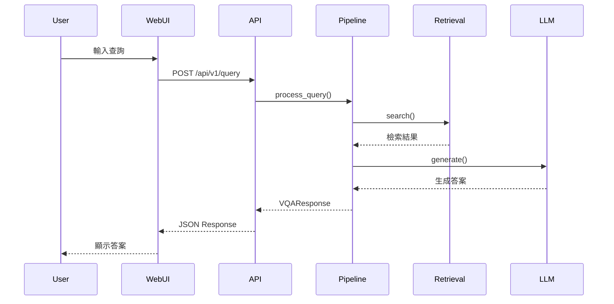

# 資料流程圖與資料格式

## 完整資料流程圖



---

## 各階段資料格式

### 1. 用戶查詢

```json
{
  "query": "請描述 2023/12/01 18:00-18:10 入口監控畫面有無異常？",
  "video_id": "entrance_20231201",
  "top_k": 5
}
```

### 2. 檢索結果

```json
{
  "results": [
    {
      "segment_id": "entrance_20231201_001",
      "score": 0.92,
      "summary": "正常進出，無異常。"
    }
  ]
}
```

### 3. LLM 輸入 Prompt

```json
{
  "prompt": "請根據以下檢索結果，簡要回答用戶問題：...",
  "model": "gpt-4o-mini"
}
```

### 4. LLM 回應

```json
{
  "answer": "根據檢索結果，未發現異常事件。"
}
```

### 5. 最終 API 回應

```json
{
  "answer": "2023/12/01 18:00-18:10 入口監控畫面未發現異常事件。",
  "retrieval_results": [
    {
      "segment_id": "entrance_20231201_001",
      "score": 0.92,
      "summary": "正常進出，無異常。"
    }
  ],
  "llm_model": "gpt-4o-mini",
  "timestamp": "2025-12-18T03:00:00Z"
}
```

---

## 錯誤處理流程

- 任一階段失敗時，皆回傳標準錯誤格式
- Pipeline 支援降級策略（如僅回傳檢索結果）
- 所有錯誤皆記錄日誌，便於追蹤

**錯誤格式範例：**

```json
{
  "error": {
    "code": 500,
    "message": "Retrieval backend unavailable"
  }
}
```

---
