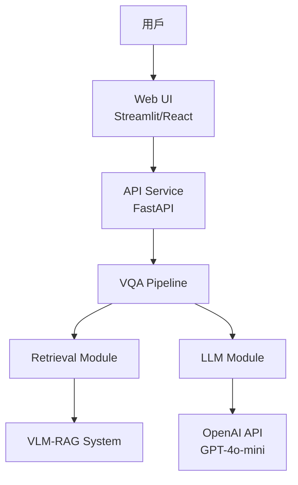

# Visual_Question_Answering(VQA) 系統架構設計

## 系統概述

Visual_Question_Answering(VQA) 是一套結合多模組的安防視頻問答系統，目標是讓使用者能以自然語言查詢監控影片內容，並獲得智慧化、即時的答案。系統整合 VLM-RAG（視覺語言檢索生成）與 LLM（大型語言模型），提供高效檢索、語意理解與答案生成能力。

本系統架構設計以「模組化」、「可擴展」、「高可用」為核心思想，將檢索、生成、流程編排、API 服務等功能分離，並支援容器化部署，方便後續維護與擴充。

---

## 系統架構圖

---

## 核心模組說明

### Retrieval Module（檢索模組）
- 與 VLM-RAG 系統對接，負責根據用戶查詢檢索相關影片片段與語意資訊。
- 提供檢索 API，回傳結構化檢索結果。

### LLM Module（生成模組）
- 封裝 OpenAI GPT-4o-mini API，負責根據檢索結果與用戶查詢生成自然語言答案。
- 支援 Prompt 管理與多模型擴展。

### Pipeline Module（流程編排）
- 負責協調檢索與生成模組，實現查詢處理流程。
- 管理狀態、錯誤處理與降級策略。

### API Module（API 服務）
- 提供 RESTful API（基於 FastAPI），對外暴露查詢、檢索、生成等端點。
- 負責請求驗證、日誌、CORS、錯誤處理等中介軟體功能。

---

## 技術棧

- **Backend**: Python 3.10+, FastAPI, OpenAI, VLM-RAG (REST API), Pydantic, Loguru
- **Frontend**: Streamlit (MVP), React + Ant Design（長期）
- **Deployment**: Docker, Docker Compose

---

## 部署架構

- 所有後端模組（API、Pipeline、Retrieval、LLM）均以 Python package 形式組成，並由 FastAPI 統一對外暴露 API。
- 前端（Streamlit/React）與後端 API 分離部署。
- VLM-RAG 系統與 OpenAI API 作為外部服務對接。
- 使用 Docker 容器化部署，支援多服務協同與擴展。
- Docker Compose 編排多個服務（API、前端、測試等）。

---

## Docker 容器設計與服務編排

- `vqa-api`: FastAPI 主服務，包含 Pipeline、Retrieval、LLM 等模組
- `frontend`: Streamlit/React 前端服務
- `vlm-rag`: 外部檢索服務（可選，若需本地部署）
- `test`: 測試與 QA 服務（可選）

所有服務可透過 Docker Compose 一鍵啟動，支援本地與雲端部署。
